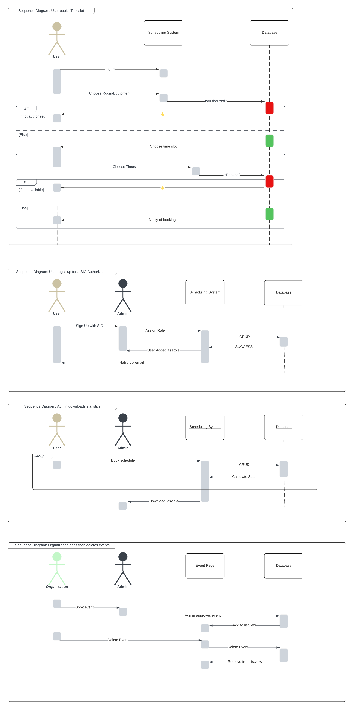

# Project Overview Document

## Executive Summary

"The Student Innovation Center (SIC) currently lacks a unified tool, making it challenging for administrators to manage resources efficiently and for students to access available facilities seamlessly. The proposed web application streamlines user management, resource booking, and event coordination, providing a professional and user-friendly solution to enhance operational efficiency. This addresses immediate challenges at the SIC while aligning with a broader campus-wide vision for innovation spaces. The current reliance on tools such as Skedda, Discord, Google Calendar, Google Forms, and email emphasizes the need for an integrated and efficient solution. University of Alberta students will be the primary users and benefit greatly from simplified access to available facilities and resources. The product will be used to book resources in advance, manage user profiles, and coordinate events seamlessly."

## Project Glossary

**Action** - Posting an event, Reserving or booking a timeslot.

**Admin** - The highest-ranking type of account in the system that has access to all possible system modifications. This role includes the ability to permit users in terms of access to specific assets.

**Analytics** - Data gathered from the actions available to users, specifically booking a timeslot is placed into an algorithm where it gives you the peak hours of a specific asset at a specific time.

**Assets** - Products and rooms available that the SIC can offer.

**Booking** - A reservation timetable for users to use and reserve an asset to their preferred timeslot.

**Events** - A feature that displays any upcoming events integrated with the calendar of the application. This includes the events from any organization permitted by an Admin to share the details.

**Feedback** - A type of form to be filled by users and give their response or assessment about the application. This will serve as a report for the Admin on how to improve the experience of the application.

**Google Suite** - A collection of applications offered by Google. This includes Google Drive, etc.

**Integrate** - Incorporate a feature into the system.

**Manage** - The ability to modify the default setup of the system.

**Permission** - Acquiring validation from an admin.

**Sync** - To make progress or saved data updated to all machines or devices at all times.

**User** - Students, organization or any "@ualberta.ca" users that have limited access to the system. The standard user has access to booking assets that don't need any special permissions coming from an Admin. Organization users are allowed to post events.

**UserType** - Users in general have default permission on what asset they can book, once an Admin permits a specific user to book a special asset, this changes the label of the user, as an additional permission has been granted.

**Visibility** - Since default users don't have access to every available asset, the user is only able to see assets that correspond to its UserType.

## Similar Products

### [**Skedda**](https://studentinnovation.skedda.com/)

- Workplace management software
- The Student Innovation Centre's current choice of a third-party app for managing room bookings.

There are a few issues with Skeeda:

- Room bookings made in the last 24 hours leading up to the booking do not show up on the admin screen.
- No place to manage resource/asset booking and no place to upload images for either rooms or resources.
- The SIC currently has about 15-20 rooms and a lot of users to manage, and as you can see from this image, that can get expensive!

(taken from [https://www.skedda.com/home/pricing](https://www.skedda.com/home/pricing))

Note how the Starter plan provides a dashboard with "limited insights". We plan to tackle this issue as well.

The Skedda booking page is something the SIC users are already used to. Hence, we'll be using the page design as inspiration for our project. Its drag-drop-booked system of booking rooms is what we plan to develop from scratch. It is requested by the client that the app should have a similar view.

### [**Fishbowl Inventory**](https://www.fishbowlinventory.com/)

Fishbowl is another similar product that we found after doing some research. While their UI is clean and their product looks like it's optimized for scaling up, the features that they offer simply don't match the needs of the Student Innovation Centre. For instance, they focus on features such as Inventory tracking, manufacturing workflow, process traceability, bill of materials (BOM), and a few more. It isn't exactly cut out for the SIC since we need an easy-to-use resource booking/management software.

#### [**Robin**](https://robinpowered.com/)

Robin is a software that focuses on Desk Booking, Room Management, and Office Analytics. It's got impressive analytics built into the CRM that can prove to be useful by the SIC. For our Analytics and Insights user stories, we plan to draw inspiration from Robin.

The one benefit of using Robin would be the advanced analytics insights it offers. It wouldn't be too practical to keep using it in the long term, check out the cost:

Starts at a base price of $399 USD per month!

Finally, we also had a look at: Condeco since one of our team members had heard of this software before:

### [**Condeco**](https://www.condecosoftware.com/)

Condeco is a Room Booking App that provides scheduling software solutions. We were able to demo the app, and it seemed too complicated to use. Condeco focuses on guest experience, workplace productivity, and employee experience, offering features like visitor management, workday planning, control over office occupancy, and more. On second thought, it's more of an employee management software than a resource booking/management software.

However, the workflow they use for bookings and management is seamless. We might end up using Confeco as an inspiration for optimization in some of the later sprints.

## Open Source Projects

There are several open-source projects that are popular and in use today.

### [**Calendly**](https://calendly.com/)

Probably the most popular open-source scheduling app out there. Pretty UI and super user-friendly! While it can be set up for free, it's mainly for scheduling online appointments. It wouldn't help too much in booking rooms, and analytics about asset usage, and it won't be easy to integrate it into a university setting/environment application.

Calendly has limited customization options and it gets challenging for it to meet specific branding needs. Calendly's booking system also cannot be embedded into another website. A lot of advanced features on their app are gatekept for premium users.

Since the Calendly UI is very easy to use, we want to model our app view after that and make it user-friendly too. It has automated scheduling capabilities for online meetings. We hope to figure out how we can use that system to make event and room booking as easy as possible for organizations on the SIC Office Management platform. Calendly is also able to assess user meeting patterns, identify peak usage times, and optimize public-facing user availability based on those numbers. These provide some excellent open-source analytics that we can use as inspiration!

### [**Easy!Appointments**](https://easyappointments.org/)

Easy!Appointments is a customizable web application that makes booking online meetings easier. The thing we linked most about it is that, just like Skedda, it uses a drag-drop-booked system of booking on the calendar view. That is very similar to the usage we are going for! While its calendar look isn't too polished, the code for the drag-and-drop UX can potentially be reused.

# High-Level Software Design

## High-Level System Architecture

## UML Class Diagram

## UML Sequence Diagram

## Low-Fidelity User interface Diagrams

Here are some broken down Lo-Fi UI images for better clarity

## Tech Stack Documentation

## Back End

- [Django](https://docs.djangoproject.com/en/5.0/) - "The web framework for perfectionists with deadlines."

### Database

- [SQLite](https://www.sqlite.org/docs.html) - what Django is compatible with.

## Deployment

- [Vercel](https://vercel.com/docs) - if needed
- Project specifications mention the [IST](https://www.ualberta.ca/information-services-and-technology/index.html) will take care of deployment.

## Front End

### Styling

- [T](https://tailwindcss.com/docs/installation)[ailwind.css](https://tailwindcss.com/docs/installation)
- [DaisyUI](https://daisyui.com/) - component library for Tailwind CSS
- Custom CSS on top of tailwind.

### Framework

- [React Library](https://react.dev/)
- [NextJS](https://nextjs.org/) - React Framework for the web
