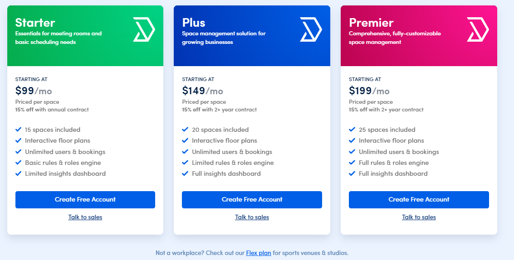
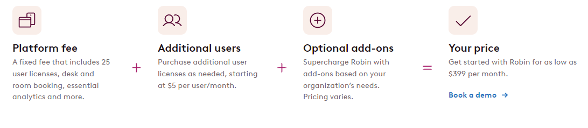

# Project Requirements

## Executive Summary

"The Student Innovation Center (SIC) currently lacks a unified tool, making it challenging for administrators to manage resources efficiently and for students to access available facilities seamlessly. The proposed web application streamlines user management, resource booking, and event coordination, providing a professional and user-friendly solution to enhance operational efficiency. This addresses immediate challenges at the SIC while aligning with a broader campus-wide vision for innovation spaces. The current reliance on tools such as Skedda, Discord, Google Calendar, Google Forms, and email emphasizes the need for an integrated and efficient solution. University of Alberta students will be the primary users and benefit greatly from simplified access to available facilities and resources. The product will be used to book resources in advance, manage user profiles, and coordinate events seamlessly."

## Project Glossary

**Action** - Posting an event, Reserving or booking a timeslot.

**Admin** - The highest-ranking type of account in the system that has access to all possible system modifications. This role includes the ability to permit users in terms of access to specific assets.

**Analytics** - Data gathered from the actions available to users, specifically booking a timeslot is placed into an algorithm where it gives you the peak hours of a specific asset at a specific time.

**Assets** - Products and rooms available that the SIC can offer.

**Booking** - A reservation timetable for users to use and reserve an asset to their preferred timeslot.

**Events** - A feature that displays any upcoming events integrated with the calendar of the application. This includes the events from any organization permitted by an Admin to share the details.

**Feedback** - A type of form to be filled by users and give their response or assessment about the application. This will serve as a report for the Admin on how to improve the experience of the application.

**Google Suite** - A collection of applications offered by Google. This includes Google Drive, etc.

**Integrate** - Incorporate a feature into the system.

**Manage** - The ability to modify the default setup of the system.

**Permission** - Acquiring validation from an admin.

**Sync** - To make progress or saved data updated to all machines or devices at all times.

**User** - Students, organization or any "@ualberta.ca" users that have limited access to the system. The standard user has access to booking assets that don't need any special permissions coming from an Admin. Organization users are allowed to post events.

**UserType** - Users in general have default permission on what asset they can book, once an Admin permits a specific user to book a special asset, this changes the label of the user, as an additional permission has been granted.

**Visibility** - Since default users don't have access to every available asset, the user is only able to see assets that correspond to its UserType.

## User Stories

### 1.01 - User Profiles

As an admin, I want to be able to assign roles to users, so that I can control their access to features.

Acceptance Tests

1. Admin can assign a role to a user successfully.
2. Admin can assign multiple roles to a user successfully.
3. Admin cannot assign a role to a user that does not exist.
4. Admin cannot assign an invalid role to a user.
5. Admin cannot assign a duplicate role to a user.
6. User's access is restricted based on the assigned role.

### 1.02 - User Profiles

As a user, I want to create and manage my profile, including my basic information and academic details.

Acceptance Tests

1. User can successfully have a profile with basic information loaded from their google account.
2. User can add academic details to their profile.
3. User can update their academic details in the profile.
4. User cannot create a profile with invalid information.
5. Users can successfully delete their profile.

### 1.03 - User Profiles

As an admin, I want to include additional information in my profile like innovation center role, so it can be visible on my profile.

Acceptance Tests

1. Admin can add the innovation center role to their profile successfully.
2. Admin can update the innovation center role in their profile.
3. Admin cannot add an invalid role to their profile.
4. Admin's profile displays the innovation center role.

### 1.04 - User Profiles

As a user, I want to upload text and link to a portfolio in my profile, so that prospective employers will see my capabilities.

Acceptance Tests

1. User can successfully upload text to their portfolio.
2. User can successfully upload links to their portfolio.
3. User can organize and manage items in their portfolio.
4. User cannot upload files with invalid formats to their portfolio.
5. User cannot upload unvetted links to their portfolio.

### 1.05 - User Profiles

As a user, I want to look up other users by using the search bar, so that I can find information about fellow SIC members

Acceptance Tests

1. User can successfully search other user.
2. User can successfully search organization.
3. User can successfully search admins.

### 1.06 - User Profiles

As a user, I want to be able to change the visibility of my portfolio, so that I can control if everyone/organizations/only me can see it.

Acceptance Tests

1. User can successfully set portfolio visibility to everyone.
2. User can successfully set portfolio visibility to organizations only.
3. User can successfully set portfolio visibility to only themselves.
4. Portfolio is displayed according to the selected visibility settings.
5. User cannot set portfolio visibility of others.

### 1.07 - User Profiles

As an admin, I want to approve AccessType Labels for users like "podcast studio", so that they can access restricted resources/rooms.

Acceptance Tests

1. Admin can approve UserType Labels for users successfully.
2. Users with approved UserType Labels gain access to the associated resources/rooms.
3. Admin can reject UserType Labels and deny access to associated resources/rooms.

### 1.08 - User Profiles

As an admin, I want to be able to disable/delete users or change their roles, so that I can prevent abuse of the system.

Acceptance Tests

1. Admin can successfully disable/delete a user account.
2. Admin can change the role of a user account.
3. Users experience appropriate access changes based on role modifications.
4. Deletion or role changes are logged for auditing purposes.
5. Users will be notified of their role change.

### 2.01 - Booking

As a user, I want to view my current bookings, so that I can review my bookings and cancel them if needed.

Acceptance Tests

1. User can view a list of their current bookings.
2. User can review details such as resource name, room number, and booking details.
3. User can cancel a booking successfully.

### 2.02 - Booking

As an admin, I want to provide the "name" of the resource, "room number", "details", "image" and "room code" description, so that resources follow a format.

Acceptance Tests

1. Admin can add a resource with a specified name, room number, and details.
2. Admin can edit the name, room number, and details of an existing resource.
3. Resources must display the specified name, room number, and details consistently.

### 2.03 - Booking

As an admin, I want to have the ability to manage assets or meeting rooms, so that assets and rooms can be added, deleted or put on maintenance.

Acceptance Tests

1. Admin can add a new asset or meeting room successfully.
2. Admin can delete an existing asset or meeting room successfully.
3. Admin can mark an asset or meeting room as under maintenance.
4. Deleted assets or rooms no longer appear in the booking system.
5. Rooms under maintenance will appear in the booking system, but will be unaccessible for the duration of the maintenance.

### 2.04 - Booking

As an admin, I want to restrict certain assets to users with special AccessType Labels, so that important assets are protected.

Acceptance Tests

1. Admin can assign UserType Labels to specific assets successfully.
2. Users with the required UserType Label can book and access restricted assets.
3. Users without the required UserType Label cannot book or access restricted assets.

### 2.05 - Booking

As an admin, I want to be able to delete the bookings of users, so that I can prevent abuse of the system.

Acceptance Tests

1. Admin can view a list of all bookings.
2. Admin can delete a specific booking successfully.
3. Deleted bookings no longer appear in the user's booking history.
4. Users will be notified of the deleted booking.

### 2.06 - Booking

As a user, I want to book a room or a resource, so that I can reserve it for myself on the website.

Acceptance Tests

1. User can search and find available rooms or resources.
2. User can select a specific time slot for the booking.
3. User receives confirmation of the successful booking.
4. User cannot book an occupied room or resource.

### 2.07 - Booking

As a user, I want to see the visibility of room bookings, so I know whether they're available or not at a glance.

Acceptance Tests

1. User can view a calendar or schedule displaying the availability of rooms.
2. Booked rooms are clearly marked on the calendar.

### 2.08 - Booking

As a user, I want to book a room at reoccurring times (daily, weekly, monthly, yearly), so that I can ensure I always have a consistent schedule.

Acceptance Tests

1. User can set up a recurring booking for a specific room.
2. User can modify or cancel recurring bookings as needed.
3. The booking system accurately reflects the recurring schedule on the calendar.
4. User cannot book the reoccuring timeslots if atleast one timeslot is already occupied.

### 3.01 - Events Calendar

As an admin, I want to approve Events submitted by organizations, so that I can control which organizations may host their Event.

Acceptance Tests

1. Admin can view a list of Events submitted by organizations.
2. Admin can approve Events, allowing them to be displayed on the Events Calendar.
3. Admin can reject Events, preventing them from being shown on the Events Calendar.

### 3.02 - Events Calendar

As an organization, I want to submit my Events on the website, so that I can host my Event at the center.

Acceptance Tests

1. Organization can submit event details, including name, room number, date(s), organization, and details.
2. Organization receives confirmation of successful event submission.
3. Organization is notified of approval or rejection by the admin.
4. Validation ensures that all required details are provided before an event is added.

### 3.03 - Events Calendar

As an admin, I want to add and manage events through the website, so that users can view events and their details.

Acceptance Tests

1. Admin can add a new event with specified details (name, room number, date(s), organization, details).
2. Admin can edit the details of an existing event.
3. Admin can delete an event successfully.
4. Deleted events no longer appear on the Events Calendar.
5. Respective Organizations will be notified of deleted events.

### 3.04 - Events Calendar

As a user, I want to view the Events Calendar, so that I can see events, workshops, and other activities happening at the center.

Acceptance Tests

1. Users can access the Events Calendar on the website.
2. Events are displayed on the calendar with relevant details (name, room number, date(s), organization).
3. Users can navigate through the calendar to view upcoming and past events.

### 3.05 - Events Calendar

As an admin, I want to integrate Google Calendar with Events Calendar, so that both calendars can be synced.

Acceptance Tests

1. Admin can initiate the integration process with Google Calendar.
2. Events added to the Events Calendar are automatically synchronized with Google Calendar.
3. Changes made in Google Calendar are reflected in the Events Calendar on the website.

### 3.06 - Events Calendar

As an admin, I want to provide the "name" of the event, "room number", "date(s)", "organization" and "details", so that events follow a consistent format.

Acceptance Tests

1. Admin is prompted to enter the name, room number, date(s), organization, and details when adding a new event.
2. Events displayed on the calendar adhere to the specified format consistently.
3. Validation ensures that all required details are provided before an event is added.

### 4.01 - Analytics

As a user, I want to access an "Insights" tab, so that I can view usage hours, peak times, and the popularity of different technologies and rooms.

Acceptance Tests

1. Users can navigate to the "Insights" tab on the website.
2. The "Insights" tab displays usage hours, peak times, and the popularity of various technologies and resources.
3. Insights are presented in a clear and understandable format.

### 4.02 - Analytics

As an admin, I want to download Analytics from the "Insights" tab as a CSV/XLS file so that I can optimize the center's operations more effectively.

Acceptance Tests

1. Admin can access the "Insights" tab on the website.
2. The "Insights" tab displays usage hours, peak times, and the popularity of various technologies and resources.
3. Insights are presented in a clear and understandable format.
4. Admin can select desired analytics data to download.
5. Admin can download analytics data in CSV or XLS format successfully.
6. Downloaded analytics file contains accurate and relevant data.

### 5.01 - Notifications

As an admin, I want to send notifications on the website to the mailbox of all users, so that they can be notified not only through Email.

Acceptance Tests

1. Admin can compose and send notifications from the admin dashboard.
2. Notifications are delivered to the mailbox of all users on the website.
3. Users receive notifications in their website mailbox.

### 5.02 - Notifications

As an admin, I want to send Email notifications to users, so that they can be informed about the latest updates, events, and opportunities related to the center.

Acceptance Tests

1. Admin can compose and send Email notifications from the admin dashboard.
2. Email notifications are sent to users' registered Email addresses.
3. Email notifications contain relevant information about updates, events, and opportunities.

### 5.03 - Notifications

As an admin, I want to have the option to check whether they want to notify users on an update, so that some updates do not send a notification.

Acceptance Tests

1. Admin has the option to enable or disable notifications for specific updates.
2. Admin can select which updates trigger notifications to users.
3. Notification settings are saved and applied accurately.

### 5.04 - Notifications

As a user, I want to have the option to toggle which types of notifications I receive, so that I get the information important to me.

Acceptance Tests

1. Users can access notification settings from their profile settings.
2. Users can toggle different types of notifications on or off.
3. Changes to notification settings are saved and applied successfully.
4. Users receive only the notifications they have opted to receive.

### 6.01 - Feedback

As an admin, I want to collect Feedback Form data, so that I can review feedback from my users.

Acceptance Tests

1. Admin can access and view collected feedback from users.
2. Feedback data includes information about feedback, reported issues, and support requests.
3. Feedback entries are organized and presented in a clear format.

### 6.02 - Feedback

As a user, I want to have access to a Feedback Form, so that I can provide feedback, report issues or seek support related to the center or the application.

Acceptance Tests

1. Users can access the Feedback Form on the website.
2. Feedback Form includes sections for general feedback, issue reporting, and support requests.
3. Users can submit feedback with relevant details.

### 6.03 - Feedback

As an admin, I want to manage Feedback Form sections, so that I can update the form and change required fields.

Acceptance Tests

1. Admin can access and update the sections of the Feedback Form.
2. Admin can add, remove, or modify fields within the Feedback Form.
3. Changes to the Feedback Form are applied successfully, and users see the updated form.

### 7.01 - Integration

As an admin, I want to ensure that the application can integrate with Google Suite, so that it can streamline management.

Acceptance Tests

1. Admin can initiate the integration process with Google Suite.
2. The application successfully connects to Google Suite services.
3. Features such as feedback are automatically sent to Google Suite.

### 7.02 - Integration

As a user, I want to sign up/in using my @ualberta.ca account, so that accessing SIC does not require extra credentials.

Acceptance Tests

1. User can sign up using their @ualberta.ca email address.
2. User can sign in using their @ualberta.ca credentials.
3. Users without @ualberta.ca email addresses cannot sign up.
4. User cannot sign in with incorrect @ualberta.ca credentials.
5. The integration provides a seamless and secure sign-up/in process using @ualberta.ca accounts.

### 8.01 - Scalability

As an admin, I want the website style to not be SIC specific, so that it can be used with other innovation and entrepreneurship spaces across campus.

Acceptance Tests

1. The website style is designed to be generic and not specific to any particular space.
2. The website's visual elements and branding are easily customizable for different spaces.
3. Style changes do not affect the functionality of the website.

### 8.02 - Scalability

As an admin, I want the website to handle expansions to future spaces, so that it can be scalable.

Acceptance Tests

1. The website can accommodate the addition of new spaces without significant modifications.
2. Navigation and structure support the inclusion of future spaces seamlessly.
3. The website's functionality remains consistent as new spaces are added.

### 8.03 - Scalability

As an admin, I want the website to have the capacity to support many users, so that it can be scalable with future growth of users.

Acceptance Tests

1. The website can handle a large number of concurrent users without performance degradation.
2. The website's responsiveness is maintained even during peak usage periods.
3. The website can support user growth without a decrease in performance.

### 9.01 - Application Portal

As a user, I want to submit entrepreneurial thinking placements, so that other users can view the opportunities available.

Acceptance Tests

1. Users can access the application portal on the website.
2. Users can browse and view available entrepreneurial thinking placements.
3. Users can submit applications for specific placements.
4. Users can upload relevant documents, such as a CV, during the application process.

### 9.02 - Application Portal

As an admin, I want to be able to manage the application/job portal placements, so that I can approve which placements are appropriate.

Acceptance Tests

1. Admin can access and review submitted applications in the admin dashboard.
2. Admin can approve or reject applications based on appropriateness.
3. Approved placements are displayed on the application portal for users.

### 9.03 - Application Portal

As a user, I want to upload a CV document to my profile, so that it can be used when I apply for placements on the application/job portal.

Acceptance Tests

1. Users can access their profile settings on the website.
2. Users can upload a CV document to their profile.
3. The uploaded CV is associated with the user's profile and can be used during placement applications.

### 9.04 - Application Portal

As a user, I want to view the profiles and the CVs of applicants, so that I can select candidates for my placements.

Acceptance Tests

1. Users can access a list of applicants for a specific placement.
2. Users can view the profiles and CVs of applicants.
3. Users can make informed decisions based on applicant profiles and CVs.

### 9.05 - Application Portal

As a user, I want to view and manage my current applications/placements, so that I can review my applications, withdraw them or delete my placements.

Acceptance Tests

1. Users can access a list of their current applications/placements on the website.
2. Users can view details of their submitted applications.
3. Users can withdraw an application or delete a placement if needed.
4. The application portal accurately reflects the status of user applications and placements.

### 9.06 - Application Portal

As a user, I want to apply to internships on the application/job portal, so that my information and resume are sent to the company that is hosting the internship.

Acceptance Tests

1. Users can view and apply to internships on the website.
2. Users can upload files to be sent to the company hosting the internship.
3. Users cannot submit an application with missing required fields.
4. Users will be notified that application was succesful upon valid submission.

### 10.01 - System Design

As an admin, I want the "Schedule" page to look similar to a previous tool, so that users can transition to the website easily.

Acceptance Tests

1. Admin can customize the design and layout of the "Schedule" page to resemble the previous tool.
2. The transition from the previous tool to the website is seamless for users.
3. Key functionalities of the "Schedule" page from the previous tool are retained on the website.

### 10.02 - System Design

As a user, I want to access the website on smaller devices, so that I can easily use it on my mobile phone.

Acceptance Tests

1. Users can access the website using smaller devices, such as mobile phones or tablets.
2. The website design is responsive and adjusts appropriately to different screen sizes.
3. All features and functionalities are accessible and user-friendly on smaller devices.
4. Make navigation intuitive and easy on smaller screens.

## MoSCoW

### Must Do

- US 1.01 As an admin, I want to be able to assign roles to users, so that I can control their access to features.
- US 1.02 As a user, I want to create and manage my profile, including my basic information and academic details.
- US 1.03 As an admin, I want to include additional information in my profile like innovation center role, so it can be visible on my profile.
- US 1.04 As a user, I want to upload text and link to a portfolio in my profile, so that prospective employers will see my capabilities.
- US 1.07 As an admin, I want to approve AccessType Labels for users like "podcast studio", so that they can access restricted resources/rooms.
- US 1.08 As an admin, I want to be able to disable/delete users or change their roles, so that I can prevent abuse of the system.
- US 6.01 As an admin, I want to collect Feedback Form data, so that I can review feedback from my users.
- US 6.02 As a user, I want to have access to a Feedback Form, so that I can provide feedback, report issues or seek support related to the center or the application.
- US 8.01 As an admin, I want the website style to not be SIC specific, so that it can be used with other innovation and entrepreneurship spaces across campus.
- US 8.03 As an admin, I want the website to have the capacity to support many users, so that it can be scalable with future growth of users.
- US 2.01 As a user, I want to view my current bookings, so that I can review my bookings and cancel them if needed.
- US 2.02 As an admin, I want to provide the "name" of the resource, "room number", "details", "image" and "room code" description, so that resources follow a format.
- US 2.03 As an admin, I want to have the ability to manage assets or meeting rooms, so that assets and rooms can be added, deleted or put on maintenance.
- US 2.05 As an admin, I want to be able to delete the bookings of users, so that I can prevent abuse of the system.
- US 2.06 As a user, I want to book a room or a resource, so that I can reserve it for myself on the website.
- US 2.07 As a user, I want to see the visibility of room bookings, so I know whether they're available or not at a glance.
- US 3.02 As an organization, I want to submit my Events on the website, so that I can host my Event at the center.
- US 3.03 As an admin, I want to add and manage events through the website, so that users can view events and their details.
- US 3.04 As a user, I want to view the Events Calendar, so that I can see events, workshops, and other activities happening at the center.
- US 3.06 As an admin, I want to provide the "name" of the event, "room number", "date(s)", "organization" and "details", so that events follow a consistent format.
- US 4.01 As a user, I want to access an "Insights" tab, so that I can view usage hours, peak times, and the popularity of different technologies and rooms.
- US 5.02 As an admin, I want to send Email notifications to users, so that they can be informed about the latest updates, events, and opportunities related to the center.
- US 7.01 As an admin, I want to ensure that the application can integrate with Google Suite, so that it can streamline management.
- US 8.02 As an admin, I want the website to handle expansions to future spaces, so that it can be scalable.

### Should Do

- US 7.02 As a user, I want to sign up/in using my @ualberta.ca account, so that accessing SIC does not require extra credentials.
- US 1.05 As a user, I want to look up other users by using the search bar, so that I can find information about my friends, organizations, and admins.
- US 2.04 As an admin, I want to restrict certain assets to users with special AccessType Labels, so that important assets are protected.
- US 10.01 As an admin, I want the "Schedule" page to look similar to a previous tool, so that users can transition to the website easily.
- US 3.05 As an admin, I want to integrate Google Calendar with Events Calendar, so that both calendars can be synced.
- US 2.08 As a user, I want to book a room at reoccurring times (daily, weekly, monthly, yearly), so that I can ensure I always has a consistent schedule.
- US 5.03 As an admin, I want to have the option to check whether they want to notify users on an update, so that some updates do not send a notification.
- US 4.02 As an admin, I want to download Analytics from the "Insights" tab as a CSV/XLS file so that I can optimize the center's operations more effectively

### Could Do

- US 6.03 As an admin, I want to manage a Feedback Form sections, so that I can update the form and change required fields.
- US 1.06 As a user, I want to be able to change the visibility of my portfolio, so that I can control if everyone/organizations/only me can see it.
- US 10.02 As a user, I want to access the website on smaller devices, so that I can easily use it on my mobile phone.
- US 3.01 As an admin, I want to approve Events submitted by organizations, so that I can control which organizations may host their Event.

### Won't Do

- US 9.06 As a user, I want to apply to internships on the application/job portal, so that my information and resume are sent to the company that is hosting the internship.
- US 9.05 As a user, I want to view and manage my current applications/placements, so that I can review my applications, withdraw them or delete my placements.
- US 9.04 As a user, I want to view the profiles and the CVs of applicants, so that I can select candidates for my placements.
- US 9.03 As a user, I want to upload a CV document to my profile, so that it can be used when I apply for placements on the application/job portal.
- US 9.02 As an admin, I want to be able to manage the application/job portal placements, so that I can approve which placements are appropriate.
- US 9.01 As a user, I want to submit entrepreneurial thinking placements, so that other users can view the opportunities available.
- US 5.04 As a user, I want to have the option to toggle which types of notifications I receive, so that I get the information important to me.
- US 5.01 As an admin, I want to send notifications on the website to the mailbox of all users, so that they can be notified not only through Email.

## Similar Products

### [**Skedda**](https://studentinnovation.skedda.com/)

- Workplace management software
- The Student Innovation Centre's current choice of a third-party app for managing room bookings.

There are a few issues with Skeeda:

- Room bookings made in the last 24 hours leading up to the booking do not show up on the admin screen.
- No place to manage resource/asset booking and no place to upload images for either rooms or resources.
- The SIC currently has about 15-20 rooms and a lot of users to manage, and as you can see from this image, that can get expensive!

(taken from [https://www.skedda.com/home/pricing](https://www.skedda.com/home/pricing))

Note how the Starter plan provides a dashboard with "limited insights". We plan to tackle this issue as well.

The Skedda booking page is something the SIC users are already used to. Hence, we'll be using the page design as inspiration for our project. Its drag-drop-booked system of booking rooms is what we plan to develop from scratch. It is requested by the client that the app should have a similar view.

### [**Fishbowl Inventory**](https://www.fishbowlinventory.com/)

Fishbowl is another similar product that we found after doing some research. While their UI is clean and their product looks like it's optimized for scaling up, the features that they offer simply don't match the needs of the Student Innovation Centre. For instance, they focus on features such as Inventory tracking, manufacturing workflow, process traceability, bill of materials (BOM), and a few more. It isn't exactly cut out for the SIC since we need an easy-to-use resource booking/management software.

#### [**Robin**](https://robinpowered.com/)

Robin is a software that focuses on Desk Booking, Room Management, and Office Analytics. It's got impressive analytics built into the CRM that can prove to be useful by the SIC. For our Analytics and Insights user stories, we plan to draw inspiration from Robin.

The one benefit of using Robin would be the advanced analytics insights it offers. It wouldn't be too practical to keep using it in the long term, check out the cost:

Starts at a base price of $399 USD per month!

Finally, we also had a look at: Condeco since one of our team members had heard of this software before:

### [**Condeco**](https://www.condecosoftware.com/)

Condeco is a Room Booking App that provides scheduling software solutions. We were able to demo the app, and it seemed too complicated to use. Condeco focuses on guest experience, workplace productivity, and employee experience, offering features like visitor management, workday planning, control over office occupancy, and more. On second thought, it's more of an employee management software than a resource booking/management software.

However, the workflow they use for bookings and management is seamless. We might end up using Confeco as an inspiration for optimization in some of the later sprints.

## Open Source Projects

There are several open-source projects that are popular and in use today.

### [**Calendly**](https://calendly.com/)

Probably the most popular open-source scheduling app out there. Pretty UI and super user-friendly! While it can be set up for free, it's mainly for scheduling online appointments. It wouldn't help too much in booking rooms, and analytics about asset usage, and it won't be easy to integrate it into a university setting/environment application.

Calendly has limited customization options and it gets challenging for it to meet specific branding needs. Calendly's booking system also cannot be embedded into another website. A lot of advanced features on their app are gatekept for premium users.

Since the Calendly UI is very easy to use, we want to model our app view after that and make it user-friendly too. It has automated scheduling capabilities for online meetings. We hope to figure out how we can use that system to make event and room booking as easy as possible for organizations on the SIC Office Management platform. Calendly is also able to assess user meeting patterns, identify peak usage times, and optimize public-facing user availability based on those numbers. These provide some excellent open-source analytics that we can use as inspiration!

### [**Easy!Appointments**](https://easyappointments.org/)

Easy!Appointments is a customizable web application that makes booking online meetings easier. The thing we linked most about it is that, just like Skedda, it uses a drag-drop-booked system of booking on the calendar view. That is very similar to the usage we are going for! While its calendar look isn't too polished, the code for the drag-and-drop UX can potentially be reused.

## Techincal Resources

### Back End

- [Django](https://docs.djangoproject.com/en/5.0/) - "The web framework for perfectionists with deadlines."

### Database

- [SQLite](https://www.sqlite.org/docs.html) - what Django is compatible with.

### Deployment

- [Vercel](https://vercel.com/docs) - if needed
- Project specifications mention the [IST](https://www.ualberta.ca/information-services-and-technology/index.html) will take care of deployment.

### Front End

### Styling

- [T](https://tailwindcss.com/docs/installation)[ailwind.css](https://tailwindcss.com/docs/installation)
- [DaisyUI](https://daisyui.com/) - component library for Tailwind CSS
- Custom CSS on top of tailwind.

### Framework

- [React Library](https://react.dev/)
- [NextJS](https://nextjs.org/) - React Framework for the web
