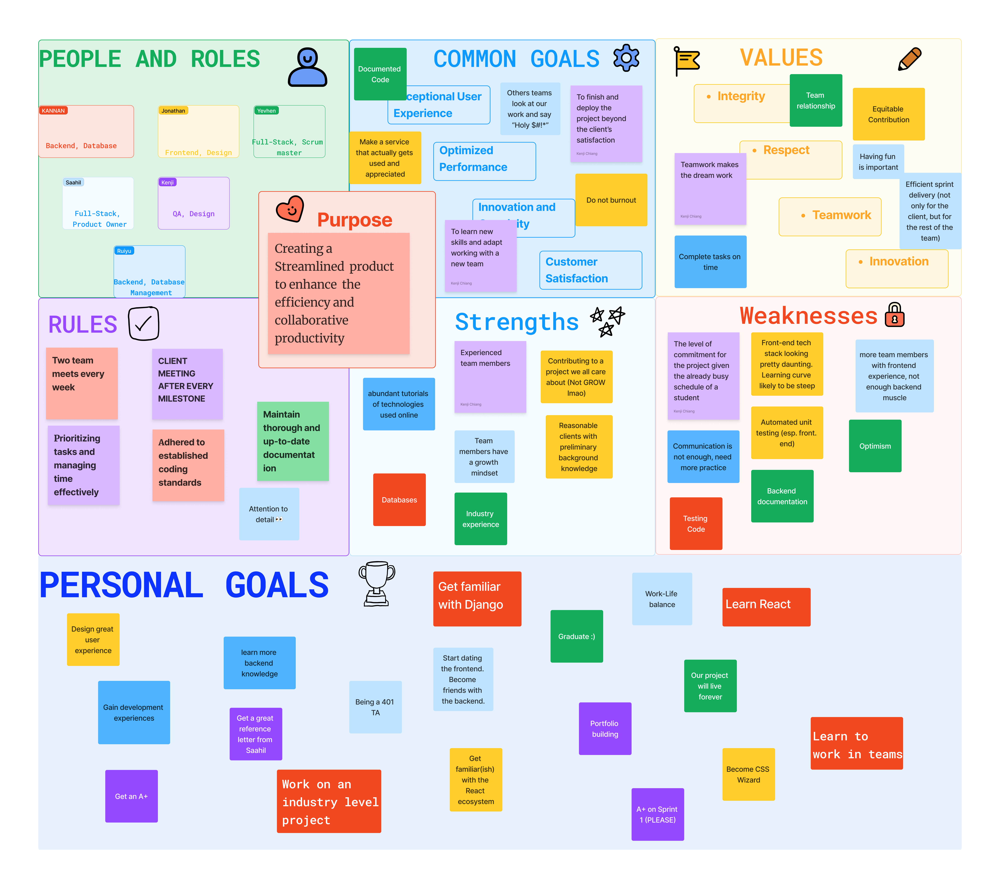

# Teamwork Document

## Team Canvas

### Scrum Roles

- **Scrum Master:** Yevhen Kaznovskyi
- **Product Owner:** Saahil Rachh

### Belbin Roles

| Name             | Preferred Roles | Manageable Roles | Least Preferred Roles |
|------------------|-----------------|------------------|-----------------------|
| Saahil Rachh     | ME, IMP, TW     | SH, RI, CF       | SP, PL, CO            |
| Jonathan Lo      | TW, CF, PL      | ME, IMP, SP      | CO, SH, RI            |
| Kannan Khosla    | CO, PL, IMP     | TW, SH, ME       | RI, CF, SP            |
| Kenji Chiang     | ME, CF, IMP     | SH, CO, PL       | TW, SP, RI            |
| Ruiyu Yuan       | IMP, CF, SP     | ME, TW, PL       | RI, CO, SH            |
| Yevhen Kaznovskyi| IMP, CO, SH     | RI, CF, SP       | ME, TW, PL            |

## Thinking Roles

#### **PL (Plant)**

_Tends to be highly creative and good at solving problems in unconventional ways._

1. Jonathan Lo (preferred)
2. Kannan Khosla (preferred)
3. Kenji Chiang (manageable)
4. Ruiyu Yuan (manageable)
5. Saahil Rachh (least preferred)
6. Yevhen Kaznovskyi (least preferred)

#### **ME (Monitor Evaluator)**

_Provides a logical eye, making impartial judgements where required and weighs up the team's options in a dispassionate way._

1. Saahil Rachh (preferred)
2. Kenji Chiang (preferred)
3. Jonathan Lo (manageable)
4. Kannan Khosla (manageable)
5. Ruiyu Yuan (manageable)
6. Yevhen Kaznovskyi (least preferred)

#### **SP (Specialist)**

_Brings in-depth knowledge of a key area to the team._

1. Ruiyu Yuan (preferred)
2. Yevhen Kaznovskyi (manageable)
3. Jonathan Lo (manageable)
4. Saahil Rachh (least preferred)
5. Kannan Khosla (least preferred)
6. Kenji Chiang (least preferred)

## Action Roles

#### **SH (Shaper)**

_Provides the necessary drive to ensure that the team keeps moving and does not lose focus or momentum._

1. Yevhen Kaznovskyi (preferred)

2. Saahil Rachh (manageable)

3. Kannan Khosla (manageable)

4. Kenji Chiang (manageable)

5. Ruiyu Yuan (least preferred)

6. Jonathan Lo (least preferred)

#### **IMP (Implementer)**

_Needed to plan a workable strategy and carry it out as efficiently as possible._

1. Yevhen Kaznovskyi (preferred)

2. Saahil Rachh (preferred)

3. Kannan Khosla (preferred)

4. Kenji Chiang (preferred)

5. Ruiyu Yuan (preferred)

6. Jonathan Lo (manageable)

#### **CF (Completer Finisher)**

_Most effectively used at the end of tasks to polish and scrutinize the work for errors, subjecting it to the highest standards of quality control._

1. Jonathan Lo (preferred)

2. Kannan Khosla (least preferred)

3. Kenji Chiang (preferred)

4. Ruiyu Yuan (preferred)

5. Saahil Rachh (manageable)

6. Yevhen Kaznovskyi (manageable)

## People Roles

#### **RI (Resource Investigator)**

_Uses their inquisitive nature to find ideas to bring back to the team._

1. Yevhen Kaznovskyi (manageable)

2. Saahil Rachh (manageable)

3. Jonathan Lo (least preferred)

4. Kannan Khosla (least preferred)

5. Kenji Chiang (least preferred)

6. Ruiyu Yuan (least preferred)

#### **TW (Teamworker)**

_Helps the team to gel, using their versatility to identify the work required and complete it on behalf of the team._

1. Saahil Rachh (preferred)

2. Jonathan Lo (preferred)

3. Ruiyu Yuan (manageable)

4. Kenji Chiang (least preferred)

5. Yevhen Kaznovskyi (least preferred)

6. Kannan Khosla (least preferred)

#### **CO (Co-ordinator)**

_Needed to focus on the team's objectives, draw out team members and delegate work appropriately._

1. Yevhen Kaznovskyi (preferred)

2. Kannan Khosla (preferred)

3. Kenji Chiang (manageable)

4. Ruiyu Yuan (least preferred)

5. Saahil Rachh (least preferred)

6. Jonathan Lo (least preferred)
